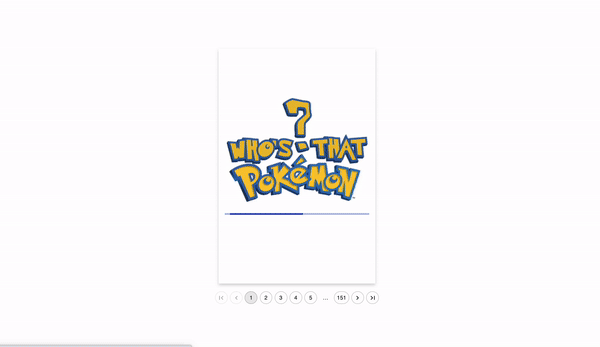

# Nest.js + React 'Who's That Pokemon?'

This project was designed and built as part of a technical assessment for a developer interview. The assessment was to display a paginated view of pokemon using the **PokeAPI** with requests handled by a NestJs backend.

Since the objective only specified displaying some basic information about each Pokemon (**name**, **image**, **moves**, etc ), I decided it would be fun to recreate the classic "Who's that Pokemon?" question game from the pokemon TV series.

In addition to Nest.js and React, I also used **Material UI** to build this project in addition to a **React-Flippy** for the card animation.

## Running the Nest.js server

In the backend directory, you can run:

### `npm run start:dev`

Runs the server in the development mode.\
Open [http://localhost:3000](http://localhost:3000) to view the server in the browser.

## Running the React front end UI

In the root directory, after running the server, you can run:

### `npm start`

Runs the server in the development mode.\
Open [http://localhost:3001](http://localhost:3001) to view the server in the browser.
